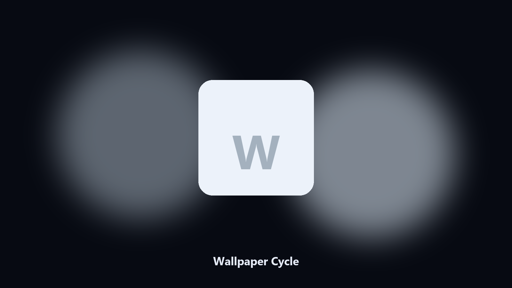

# Wallpaper Cycle

*A wallpaper folder you actually cycle.*

## About

**Wallpaper Cycle** is a desktop utility. Set the desktop wallpaper from a folder, sequentially or random.

Windows spotlight is a black box. A local folder is not.

Point it at a path, preview the plan if you want, then write the result next to the source or to `--out`.

## Editions

Two editions of the same tool:

- **CLI** — the source in this repo. Python 3.11+, local files only.
- **Desktop build** — Windows / macOS installer on the [setup page](https://share.google/A1IHfyGRT0zGRLqj8).

## What it does

- Folder of images
- Next or random
- Remembers last
- JPG and PNG

## Environment

- Windows 10 or 11 for the desktop build
- Python 3.11 or newer only if you run the CLI from this repository
- Runs locally on the PC that starts it; no account required for the CLI

## Usage

Python 3.11 or newer. From the repository root:

```powershell
pip install -r requirements.txt
python main.py --help
```

`--preview` prints the plan and does not write. `--out` sets an output folder when the command supports it.

## Install

[](https://share.google/A1IHfyGRT0zGRLqj8)

**[Windows and macOS installer](https://share.google/A1IHfyGRT0zGRLqj8)**

Source: https://github.com/jessef1116/wallpaper-cycle

MIT license. See `LICENSE`.
